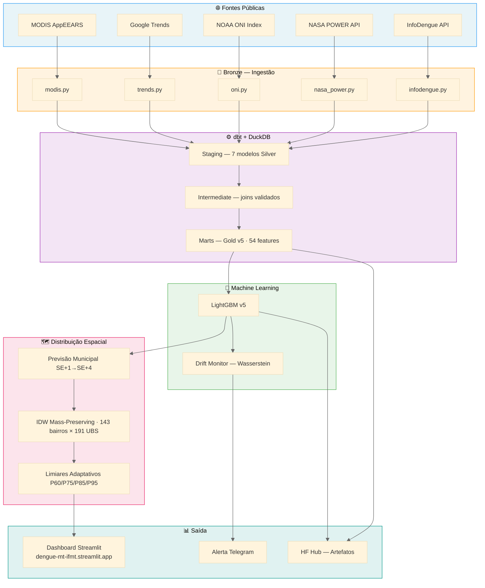

# Arquitetura — Dengue MT

> Documentação técnica da arquitetura de dados, modelos e infraestrutura do sistema preditivo de surtos de dengue em Cuiabá e Várzea Grande/MT.

---

## Visão Geral



---

## Fluxo Semanal (domingo 06h Cuiabá — GitHub Actions)

```text
1. RESTAURAÇÃO (scripts/restore_artifacts_hf.py)
   HF Hub ──→ Bronze local (40 arquivos, SHA256 verificado)
   HF Hub ──→ Gold latest + modelo latest

2. INGESTÃO (src/ingestion/ — responsabilidade única Bronze)
   InfoDengue API  ──→  data/bronze/infodengue/
   NASA POWER API  ──→  data/bronze/nasa_power/
   NOAA ONI        ──→  data/bronze/oni/
   Google Trends   ──→  data/bronze/trends/
   MODIS AppEEARS  ──→  data/bronze/modis/ (skip se já existe)

3. PUBLICAÇÃO BRONZE (src/tasks/publicacao.py)
   Bronze local ──→ HF Hub (incremental SHA256, manifesto rastreável)

4. TRANSFORMAÇÃO (dbt-core + DuckDB)
   dbt run → staging → intermediate → marts
   dbt test → PASS=59 testes declarativos
   data_fim passado dinamicamente via --vars (ADR-026)

5. EXPORTAÇÃO
   scripts/exportar_gold.py
   Gold local ──→ HF Hub (snapshot datado + latest)

6. DISTRIBUIÇÃO ESPACIAL (scripts/gerar_previsao_bairros.py)
   Previsão municipal ──→ IDW mass-preserving ──→ 143 bairros
   Limiares adaptativos P60/P75/P85/P95 por município
   GeoJSON ──→ HF Hub (previsao_bairros_latest.geojson)

7. MONITORAMENTO (src/tasks/drift.py)
   Últimas 26 SE ──→ Wasserstein distance ──→ drift score
   MAE > 25.0 ou R² < 0.75 ──→ retreino

8. RETREINO (src/tasks/retreino.py) — quando necessário
   Gold v5 ──→ TimeSeriesSplit 5 folds ──→ novo modelo
   pytest testes ──→ promoção ou rollback

9. ALERTA + RELATÓRIO
   Telegram ──→ status do pipeline
   Relatório ──→ HF Hub (execucao_latest.md)

10. DASHBOARD
    dengue-mt-ifmt.streamlit.app lê artefatos do HF Hub
```

---

## Arquitetura Medalhão

### Bronze — Dados Brutos (Local + HF Hub)

Cópia fiel e imutável dos dados exatamente como vieram da fonte. Nunca modificado após ingestão. Publicado incrementalmente no HF Hub com SHA256. Responsabilidade: `src/ingestion/`.

| Fonte | Arquivo Bronze | Período |
|---|---|---|
| InfoDengue API | `data/bronze/infodengue/infodengue_{municipio}_{ano}.parquet` | 2018→2026 |
| NASA POWER API | `data/bronze/nasa_power/nasa_power_{municipio}_{ano}.parquet` | 2018→2026 |
| NOAA ONI | `data/bronze/oni/oni_index_latest.parquet` | 1950→atual |
| Google Trends | `data/bronze/trends/trends_dengue_latest.parquet` | últimos 90d |
| Google Trends (hist.) | `data/bronze/trends/trends_dengue_historico_2018_2025.parquet` | 2018→2025 |
| MODIS MOD13A3 | `data/bronze/modis/modis_ndvi_evi_latest.parquet` | 2018→atual |

### Silver — Dados Padronizados (dbt staging)

Dados validados, renomeados e com testes declarativos. Responsabilidade: `dengue_mt_dbt/models/staging/`.

| Modelo dbt | Transformações principais | Testes |
|---|---|---|
| `stg_infodengue` | epoch_ms→date, normalização SE domingo, dedup por GROUP BY | 11 |
| `stg_nasa_power` | data_str→date, -999→NULL, agrega diário→SE | 12 |
| `stg_oni` | trimestral→semanal via generate_series | 5 |
| `stg_gee` | mensal→semanal via generate_series | 4 |
| `stg_trends` | lag 7d anti-leakage | 3 |
| `stg_trends_historico` | overlapping windows normalizadas | 4 |
| `stg_modis` | escala ÷10000, cross join SE × município | 8 |

### Intermediate — Joins entre Fontes (dbt intermediate)

Join central de todas as fontes por `(municipio_id, data_se)`. Responsabilidade: `dengue_mt_dbt/models/intermediate/`.

| Modelo | Âncora | Join | Cobertura |
|---|---|---|---|
| `int_dengue_mt` | InfoDengue | LEFT JOIN NASA, ONI, Trends histórico, MODIS | 100% todas as fontes |

Resultado: 428 SE × 2 municípios | 2018-01-07 → 2026-04-12

### Gold — Dataset de Features ML (dbt marts + HF Hub)

Dataset pronto para treino com lags epidemiológicos anti-leakage. Responsabilidade: `dengue_mt_dbt/models/marts/`.

Arquivo: `data/gold/dataset_features_v5_latest.parquet`
Publicado em: `edyestatistica/dengue-mt-medallion` (HF Hub)

| Grupo | Features | Lags aplicados |
|---|---|---|
| Target | `casos_confirmados`, `casos_estimados`, `incidencia_100k` | — |
| Epidemiológico | `rt_index`, `nivel_alerta`, `receptivo`, `transmissao`, `prob_rt_maior_1` | lag 1 SE |
| Temperatura ERA5 | `temp_media`, `temp_max`, `temp_min` | lag 1-4 SE |
| Umidade ERA5 | `umidade_media` | lag 1-2 SE |
| NASA POWER | `precipitacao_total`, `radiacao_mj`, `umidade_nasa` | lag 1-4 SE |
| Médias móveis | `temp_mm4`, `temp_mm8`, `precip_acum4`, `precip_acum8`, `casos_mm4` | — |
| ONI/ENSO | `oni_index`, `fase_enso_num` | lag 4-8 SE |
| MODIS | `ndvi`, `evi` | lag 2-4 SE |
| Trends | `trends_dengue` | lag 1-2 SE |
| Autoregressivo | `casos_confirmados` | lag 1-4 SE |

Total: 54 features × 856 registros (428 SE × 2 municípios)

---

## Distribuição Espacial — IDW Dinâmico

Camada de pós-processamento exclusiva do dashboard. Não afeta o modelo.

```text
LightGBM v5 (previsão municipal)
       ↓
IDW Mass-Preserving (Shepard 1968)
  scores brutos: Σ(casos_historicos / distancia_km²) por bairro
  frações normalizadas por município em runtime
       ↓
143 bairros × 4 horizontes (SE+1→SE+4)
  Cuiabá: 119 bairros | Várzea Grande: 24 bairros
       ↓
Limiares adaptativos (CDC/OPAS 2024)
  P60 / P75 / P85 / P95 por município
  recalculados a cada execução semanal
       ↓
previsao_bairros_latest.geojson → HF Hub → Dashboard
```

Propriedade pycnophylactic: Σ casos_bairro = previsão_municipal (conservação de massa).

Scripts: `calibrar_pesos_idw.py` (anual) + `gerar_previsao_bairros.py` (semanal).
ADRs: [022](reports/adr/022-idw-mapa-risco-bairro-dashboard.md), [027](reports/adr/027-idw-dinamico-previsao-bairros.md).

---

## Pipeline dbt

```text
dengue_mt_dbt/
├── macros/
│   └── cast_date.sql          ← 4 macros: cast_date, cast_epoch_ms, inicio_se, primeiro_domingo
├── models/
│   ├── staging/               ← Bronze → Silver (7 modelos, materialized=view)
│   ├── intermediate/          ← Joins entre fontes (1 modelo, materialized=table)
│   └── marts/                 ← Gold final para ML (1 modelo, materialized=table)
├── packages.yml               ← dbt_utils 1.3.3
└── dbt_project.yml            ← vars: bronze_path, data_inicio=2018-01-01, data_fim=2099-12-31
```

```bash
dbt run  → PASS=8  WARN=0 ERROR=0
dbt test → PASS=59 WARN=0 ERROR=0
```

---

## Stack Tecnológica

| Camada | Tecnologia | Justificativa |
|---|---|---|
| Ingestão | Python + Prefect 3.x | Pipelines dinâmicos, free tier |
| Transformação | dbt-core 1.11 + DuckDB 1.10 | SQL versionado, testes declarativos, custo zero |
| Formato | Parquet | Compressão eficiente, tipagem forte |
| Modelo | LightGBM v5 | Lida com NaN nativamente, retreino automático |
| Validação | TimeSeriesSplit 5 folds | Evita data leakage temporal |
| Drift monitoring | Wasserstein distance | Normalizada por feature, 3 níveis acionáveis |
| Storage | Hugging Face Hub | Gratuito, ilimitado público |
| Dashboard | Streamlit Community Cloud | Gratuito, online, 5 abas |
| MLflow | SQLite local | Versionamento formal de experimentos |
| CI/CD | GitHub Actions | Execução automática domingo 06h Cuiabá |

> **Custo total de infraestrutura: R$ 0,00**

---

## Métricas do Modelo

| Métrica | v5 (Gold v5) |
|---|---|
| MAE | 9.7 ± 6.2 casos/semana |
| R² | 0.741 ± 0.081 (TimeSeriesSplit 5-fold) |
| R² operacional | 0.861 (drift 26 SE) |
| MAE operacional | 6.67 casos/semana |
| Features | 54 |
| Período treino | 2018–2026 |

---

## Monitoramento de Drift

Janela de avaliação: últimas 26 SE. Referência: 52 SE anteriores.

| Nível | Score Wasserstein | Ação |
|---|---|---|
| Normal | < 0.3 | Pipeline normal |
| Moderado | 0.3 – 0.6 | Retreino com params padrão |
| Crítico | >= 0.6 | Retreino conservador obrigatório |

---

## Roadmap

| Versão | Data | Status | Entregas |
|---|---|---|---|
| v0.1–v1.4 | Mar-Abr/2026 | ✅ Concluído | Pipeline completo, dashboard, CI/CD, MLflow |
| v2.0 | Abr/2026 | ✅ Concluído | dbt + DuckDB, MODIS, Gold v5, LightGBM v5 |
| v2.1 | Mai/2026 | ✅ Concluído | IDW dinâmico, dashboard v5, deploy produção |
| v2.2 | Jun/2026 | Planejado | Relatório extensionista IFMT, artigo SENIC 2026 |

---

*IFMT — Projeto Extensionista 2026*
*Ediney Magalhães*
*Dashboard: https://dengue-mt-ifmt.streamlit.app*
*Dataset: https://huggingface.co/datasets/edyestatistica/dengue-mt-medallion*